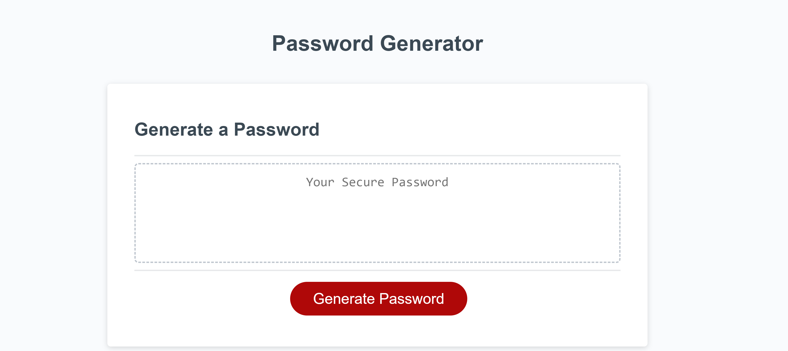

# Password-Generator-Challenge

## Description
This was the module 3 project for the UT/EdX coding bootcamp, which tasked me with completing provided Javascript code in order to make a function that would generate a random password meeting certain criteria. The project allowed me to gain practical expericence with Javascript variables, data types, methods, loops, and functions. This included problem solving around how to combine these different JavaScript components to solve a problem, in this case to prompt a user for critera and generate a random password string in response. I learned how to prompt users for input, how to choose random items from an array, and how to use the '.split' method demonstrated in class to convert data from one type to another. 

## Table of Contents (Optional)

## Installation

The page runs in the browser, no special installation required.

## Usage

To use the password generator click the red "Generate Password" button, and then follow on screen prompts for text information to enter. The website is accessible at the following URL: https://victoria-cg.github.io/Password-Generator-Challenge/

    

    

## Credits

References:

Syntax for JavaScript picking a random item from an array:
 Kirupa. (n.d.). Picking a Random Item from an Array | kirupa.com. KIRUPA. Retrieved January 14, 2024, from https://www.kirupa.com/html5/picking_random_item_from_array.htm

Syntax for NaN at line 11 validation: 
Mozilla. (2023, December 6). NaN - JavaScript | MDN. MDN Web Docs. Retrieved January 16, 2024, from https://developer.mozilla.org/en-US/docs/Web/JavaScript/Reference/Global_Objects/NaN

Syntax for alerts:
Mozilla. (2023, October 4). Window: alert() method - Web APIs | MDN. MDN Web Docs. Retrieved January 16, 2024, from https://developer.mozilla.org/en-US/docs/Web/API/Window/alert

Reference for special characters:
Krawczyk, P. (n.d.). Password Special Characters. OWASP Foundation. Retrieved January 16, 2024, from https://owasp.org/www-community/password-special-characters

Reference for using ".split" to turn a string into an array:
Ming, S. (2024). 4 Ways to Convert String to Character Array in JavaScript | SamanthaMing.com. Samantha Ming. Retrieved January 16, 2024, from https://www.samanthaming.com/tidbits/83-4-ways-to-convert-string-to-character-array/

Tutorial for 'for' loops syntax:
Net Ninja. (2017, November 9). JavaScript Tutorial For Beginners #17 - For Loops. YouTube: Home. Retrieved January 16, 2024, from https://www.youtube.com/watch?v=U87UmD-5h4o&list=PL4cUxeGkcC9i9Ae2D9Ee1RvylH38dKuET&index=18

EdX Xpert AI consulted/used as reference material for use of “+=” concatenation at line 59 to debug that code and fill in the finalPassword variable with all the looped randomly selected characters.

Collaboration during office hours with class TA Walter Perry and classmate Carlos Asencio-Morales: They assisted with troubleshooting by suggesting I use "confirm" booleans for user input type, as well as suggesting that I use strings and concatenation to combine the user responses. 

## License

MIT license available for reference in the LICENSE section of the repository.
---
